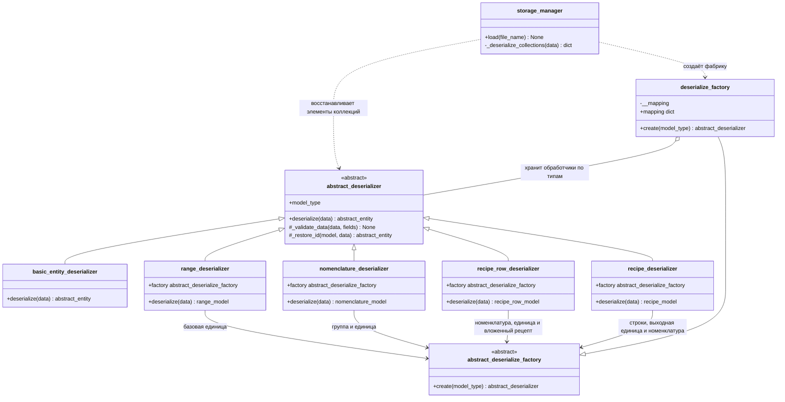

# Диаграмма классов десериализации JSON

```mermaid
classDiagram
    direction TB

    class storage_manager {
        +load(file_name) None
        -_deserialize_collections(data) dict
    }
    class abstract_deserialize_factory {
        <<abstract>>
        +create(model_type) abstract_deserializer
    }
    class deserialize_factory {
        -__mapping
        +mapping dict
        +create(model_type) abstract_deserializer
    }
    class abstract_deserializer {
        <<abstract>>
        +model_type
        +deserialize(data) abstract_entity
        #_validate_data(data, fields) None
        #_restore_id(model, data) abstract_entity
    }
    class basic_entity_deserializer {
        +deserialize(data) abstract_entity
    }
    class range_deserializer {
        +factory abstract_deserialize_factory
        +deserialize(data) range_model
    }
    class nomenclature_deserializer {
        +factory abstract_deserialize_factory
        +deserialize(data) nomenclature_model
    }
    class recipe_row_deserializer {
        +factory abstract_deserialize_factory
        +deserialize(data) recipe_row_model
    }
    class recipe_deserializer {
        +factory abstract_deserialize_factory
        +deserialize(data) recipe_model
    }

    abstract_deserialize_factory <|-- deserialize_factory
    abstract_deserializer <|-- basic_entity_deserializer
    abstract_deserializer <|-- range_deserializer
    abstract_deserializer <|-- nomenclature_deserializer
    abstract_deserializer <|-- recipe_row_deserializer
    abstract_deserializer <|-- recipe_deserializer

    storage_manager ..> deserialize_factory : создаёт фабрику
    storage_manager ..> abstract_deserializer : восстанавливает элементы коллекций
    deserialize_factory o-- abstract_deserializer : хранит обработчики по типам

    range_deserializer --> abstract_deserialize_factory : базовая единица
    nomenclature_deserializer --> abstract_deserialize_factory : группа и единица
    recipe_row_deserializer --> abstract_deserialize_factory : номенклатура, единица и вложенный рецепт
    recipe_deserializer --> abstract_deserialize_factory : строки, выходная единица и номенклатура
```

