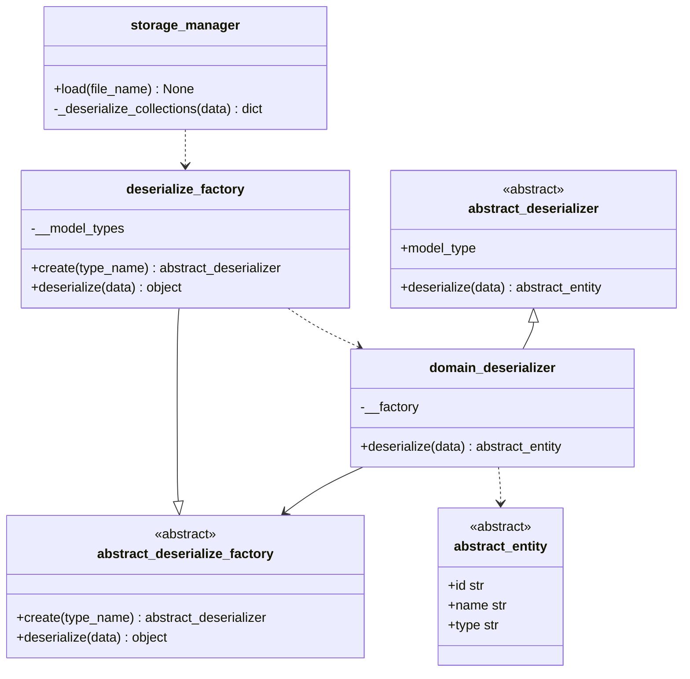

# Диаграмма классов десериализации JSON

```mermaid
classDiagram
    direction TB

    class storage_manager {
        +load(file_name) None
        -_deserialize_collections(data) dict
    }
    class abstract_deserialize_factory {
        <<abstract>>
        +create(type_name) abstract_deserializer
        +deserialize(data) object
    }
    class deserialize_factory {
        -__model_types
        +create(type_name) abstract_deserializer
        +deserialize(data) object
    }
    class abstract_deserializer {
        <<abstract>>
        +model_type
        +deserialize(data) abstract_entity
    }
    class domain_deserializer {
        -__factory
        +deserialize(data) abstract_entity
    }
    class abstract_entity {
        <<abstract>>
        +id str
        +name str
        +type str
    }

    abstract_deserialize_factory <|-- deserialize_factory
    abstract_deserializer <|-- domain_deserializer
    storage_manager ..> deserialize_factory 
    deserialize_factory ..> domain_deserializer
    domain_deserializer --> abstract_deserialize_factory
    domain_deserializer ..> abstract_entity
```
