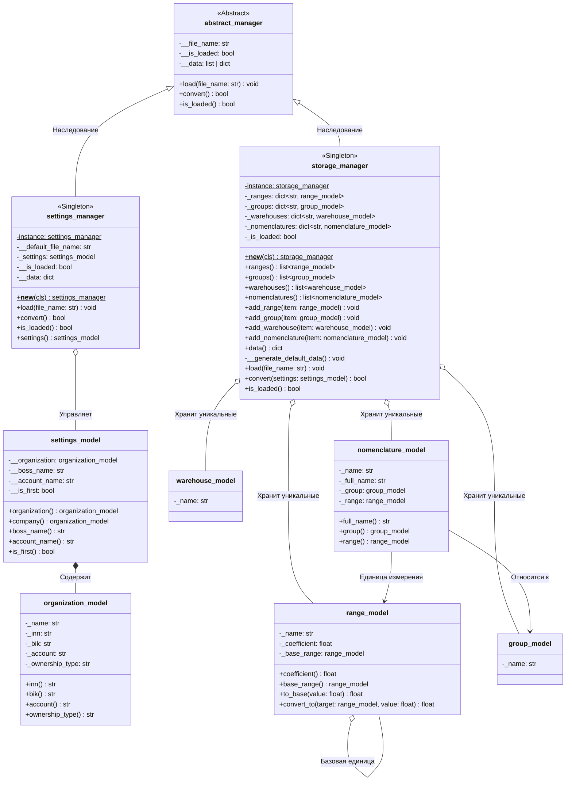
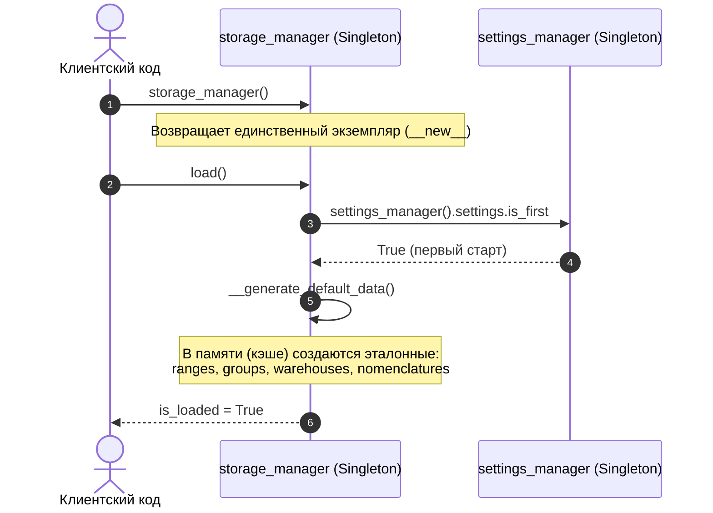

# UML диаграммы классов для `settings_manager` и `storage_manager`

Ниже представлены UML-диаграммы классов, отражающие структуру менеджеров, применение паттерна **Singleton**, отношение наследования от `abstract_manager`, а также связи с доменными моделями.

---

## 1. UML диаграмма классов

---

## 2. Диаграмма взаимодействия при первом старте (First Start)

