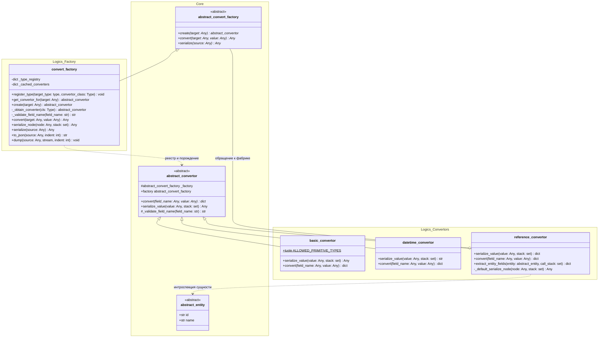

# Диаграммы сериализации в JSON

## 1. Диаграмма классов

```mermaid
classDiagram
    direction TB

    namespace Core {
        class abstract_convert_factory {
            <<abstract>>
            +create(target: Any) abstract_convertor*
            +convert(target: Any, value: Any) Any*
            +serialize(source: Any) Any*
        }

        class abstract_convertor {
            <<abstract>>
            #abstract_convert_factory _factory
            +factory abstract_convert_factory
            +convert(field_name: Any, value: Any) dict*
            +serialize_value(value: Any, stack: set) Any
            #_validate_field_name(field_name: str) str
        }

        class abstract_entity {
            <<abstract>>
            +str id
            +str name
        }
    }

    namespace Logics_Convertors {
        class basic_convertor {
            +tuple ALLOWED_PRIMITIVE_TYPES$
            +serialize_value(value: Any, stack: set) Any
            +convert(field_name: Any, value: Any) dict
        }

        class datetime_convertor {
            +serialize_value(value: Any, stack: set) str
            +convert(field_name: Any, value: Any) dict
        }

        class reference_convertor {
            +serialize_value(value: Any, stack: set) dict
            +convert(field_name: Any, value: Any) dict
            +extract_entity_fields(entity: abstract_entity, call_stack: set) dict
            -_default_serialize_node(node: Any, stack: set) Any
        }
    }

    namespace Logics_Factory {
        class convert_factory {
            -dict _type_registry
            -dict _cached_converters
            +register_type(target_type: type, convertor_class: Type) void
            +get_convertor_for(target: Any) abstract_convertor
            +create(target: Any) abstract_convertor
            -_obtain_converter(cls: Type) abstract_convertor
            -_validate_field_name(field_name: str) str
            +convert(target: Any, value: Any) Any
            +serialize_node(node: Any, stack: set) Any
            +serialize(source: Any) Any
            +to_json(source: Any, indent: int) str
            +dump(source: Any, stream, indent: int) void
        }
    }

    abstract_convert_factory <|-- convert_factory
    abstract_convertor <|-- basic_convertor
    abstract_convertor <|-- datetime_convertor
    abstract_convertor <|-- reference_convertor

    convert_factory ..> abstract_convertor : реестр и порождение
    reference_convertor o-- abstract_convert_factory : обращение к фабрике
    reference_convertor ..> abstract_entity : интроспекция сущности
```

---

